# Continuous Integration / Continuous Delivery (CI/CD) Pipeline

In order to update the website in a quick and effective way, we've implemented CI/CD pipelines for both of our website repositories, [fyt-website-react](https://github.com/FindYourTotem/fyt-website-react) and [fyt-app-react](https://github.com/FindYourTotem/fyt-app-react). We leveraged two AWS Developer Tools, CodeBuild and CodePipeline, in order to automate our updates.

Every time a change is merged into the master branch for either repository, a CodePipeline will execute, which will run a CodeBuild project that will build the website and copy the build files into a S3 bucket. The S3 bucket is already configured so that any files on the S3 bucket will be reflected onto the website.

See below for steps on building our CI/CD pipeline (This tutorial assumes we are creating a CI/CD pipeline for "fyt-app-react"):

## Phase 1: Create a CodeBuild Project

We use CodeBuild to automatically build/compiled our code and upload the compiled code (aka an artifact) to S3.

Go to the [CodeBuild Homepage](https://console.aws.amazon.com/codesuite/codebuild/home) and select "Create Project".

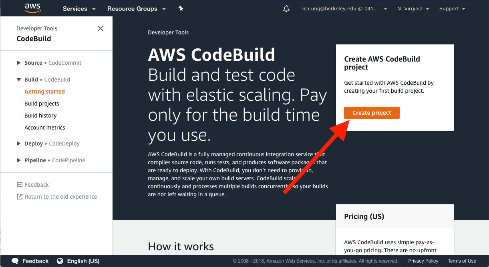

Next, fill in the following information to create a build project. Assume to leave any extraneous fields blank:
* Project name: FYT-Website-App
* Source
  * Source provider: GitHub
  * Repository: Repository in my GitHub account
    * **Note that you will next have to connect your GitHub account to CodeBuild**
  * GitHub repository: FindYourTotem/fyt-website-react
  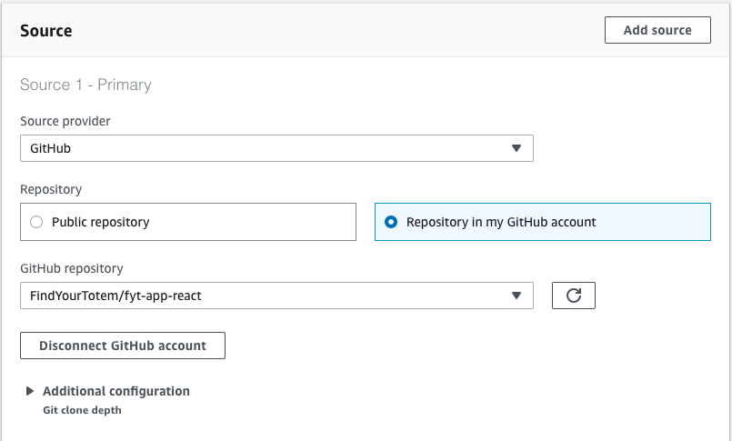
  *This is where you provide the source code of the project that you are trying to build.*
* Environment
  * Managed image
    * Operating system: Ubuntu
    * Runtime: Node.js
    * Runtime version: aws/codebuild/nodejs:10.1.0
    * Image version: Always use the latest image for this runtime version
  * Service role: New service role
  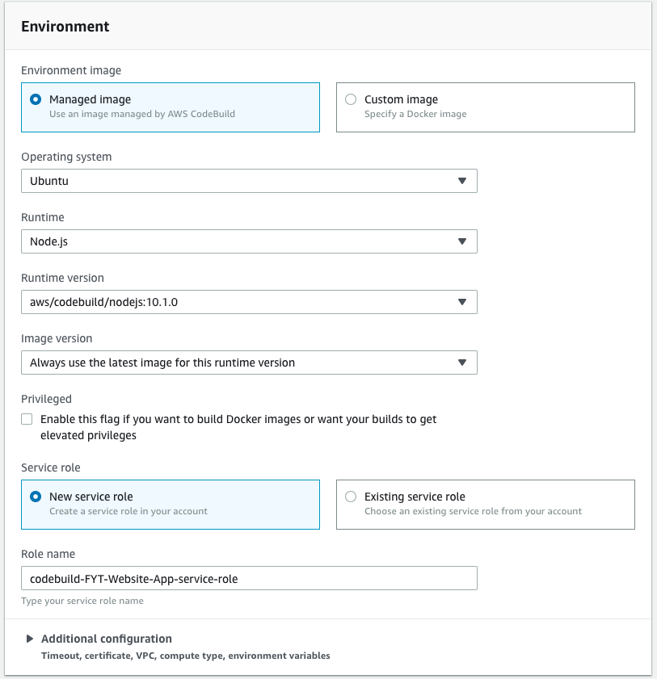
  *This step is where you configure the environment used to build your project. More technically, CodeBuild uses this configuration to create a Docker image and place your source code into the Docker image to build the project. See [here](https://docs.aws.amazon.com/codebuild/latest/userguide/build-env-ref.html) for more details.*
* Buildspec
  * Build specifications: Use a buildspec file
  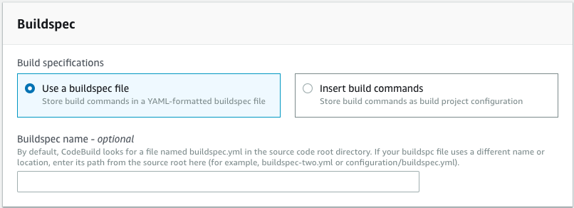
  *Later we will create a buildspec.yml file, and place the file into the base directory of the repository. This file provides a set of configurations/commands to actually build the project using the source code and environment specified above.*
* Artifacts
  * Type: No artifacts
  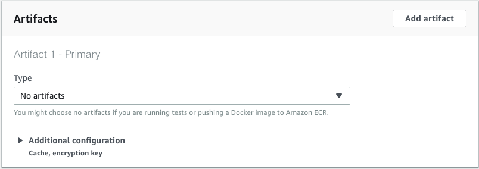
  * *Normally we would use this step to upload the compiled files onto S3, but I had trouble configuring this step so that it uploads the correct file structure and thereby properly loads the website. Instead of using this step, I found it easier to include a `aws s3 sync --delete build/` post_build command within the "buildspec.yml" file that also does the upload (which is in the next section of this tutorial).*

Next, select "Create build project" to create your project.

## Phase 2: Design and test our CodeBuild Project

After creating the CodeBuild project, create a buildspec.yml file and place it into the base directory of the repository. This provides commands to CodeBuild on how to build the project. Here's an example buildspec.yml file:

** Note: Be sure to replace `<S3 location>` with the location of the S3 bucket that the website is hosted.**

```
version: 0.2
phases:
 install:
   commands:
     - echo "install step"
     - npm install
 pre_build:
   commands:
     - echo "pre_build step"
 build:
   commands:
     - npm run build
 post_build:
   commands:
     - echo "post_build step"
     - aws s3 sync --delete build/ s3://<S3 location>/
```

The different ways you can configure the buildspec.yml file can be found in the [documentation here](https://docs.aws.amazon.com/codebuild/latest/userguide/build-spec-ref.html#build-spec-ref-syntax).

More specifically, CodeBuild creates an image with the environment specified earlier, and loads the repository into that image. CodeBuild then runs the commands from buildspec.yml in order from the base directory of the repository. For example, the commands `npm install` and `npm build` are typical commands to build Node.js projects. Next, push the buildspec.yml file into the repository.

### Adding an S3 policy to the CodeBuild's service role

Since we are using an `aws s3 sync` command within the buildspec.yml file instead of the Artifact step in CodeBuild, we also have to update the CodeBuild service role so that the buildspec.yml commands have the permission necessary to access and modify the S3 bucket.

First, select your project within the AWS Console:
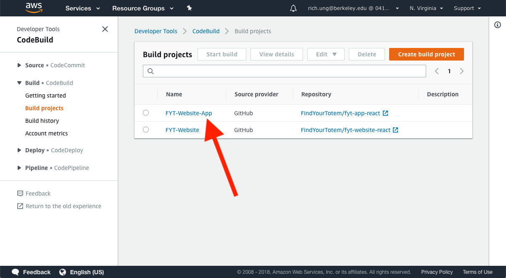
Next, select "Build details":
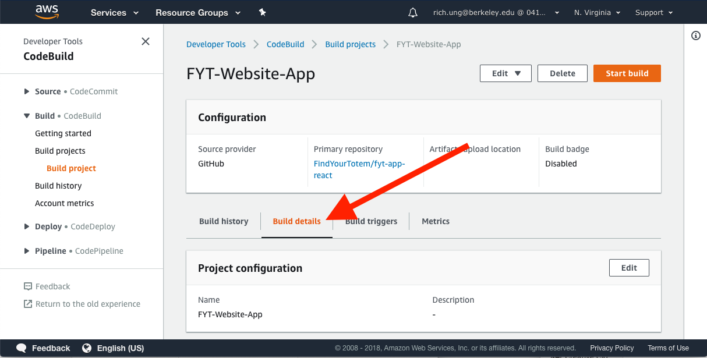
Next, select the service role used to execute the CodeBuild project:
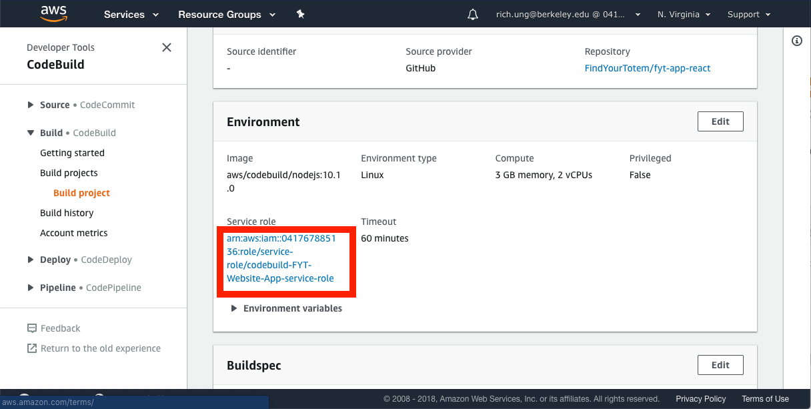
Lastly, select "Attach policies" and attach the "AmazonS3FullAccess" policy to your service role:
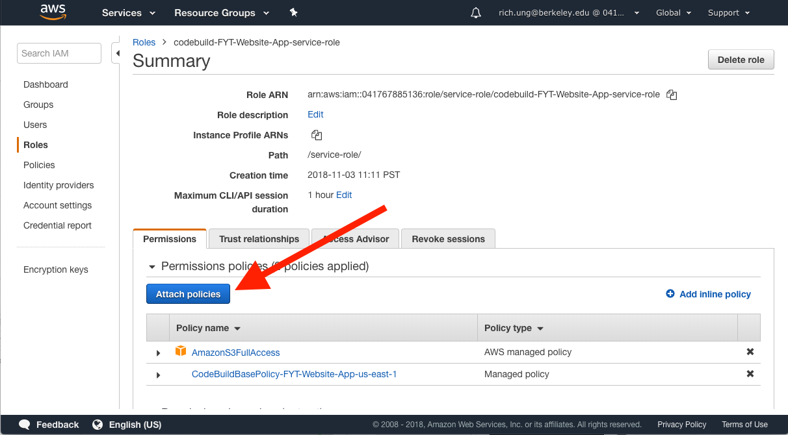

### Testing the build

After loading buildspec.yml file into the repository, you can test the build by first selecting the build project and selecting "Start build" (keeping all defaults).

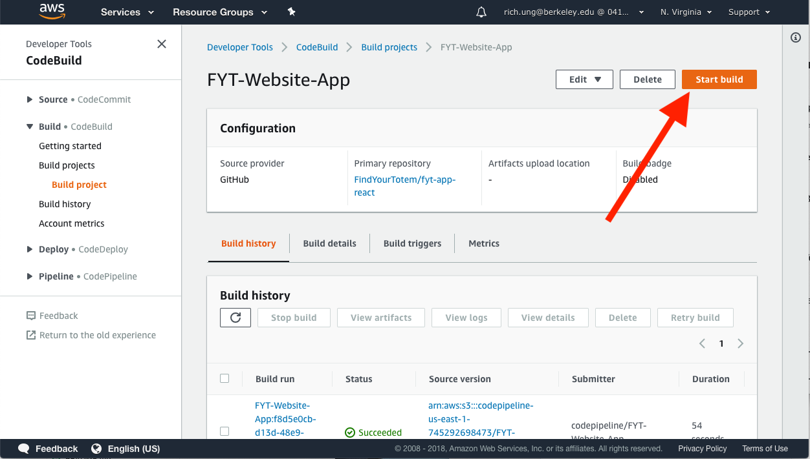

## Phase 3: Create a CodePipeline Project

After verifying that the CodeBuild project successfully runs, we then automate the CodeBuild project through CodePipeline. This is where we set up our continuous deployment, so that every time a change is merged to the master branch, we execute the CodeBuild project.

Go to the [CodePipeline homepage](https://console.aws.amazon.com/codesuite/codepipeline/pipelines) and select "Create pipeline".

Next, fill in the following information to create a CodePipeline project:

* Pipeline name: FYT-Website-App
* Service role: New service role
* Check: Allow AWS CodePipeline to create a service role so it can be used with this new pipeline
* Artifact store: Default location
  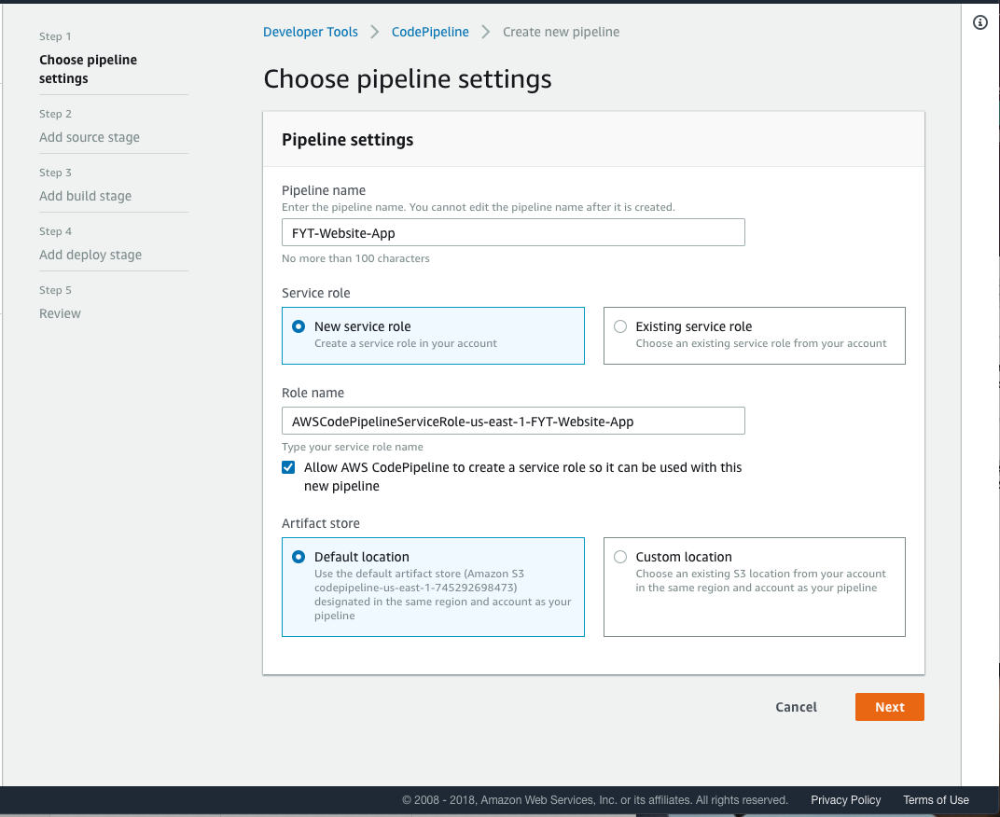
* Source provider: GitHub
  * Connect to GitHub and select the "FindYourTotem/fyt-website-react" repository
  * Branch: master
  * Change detection options: GitHub webhooks
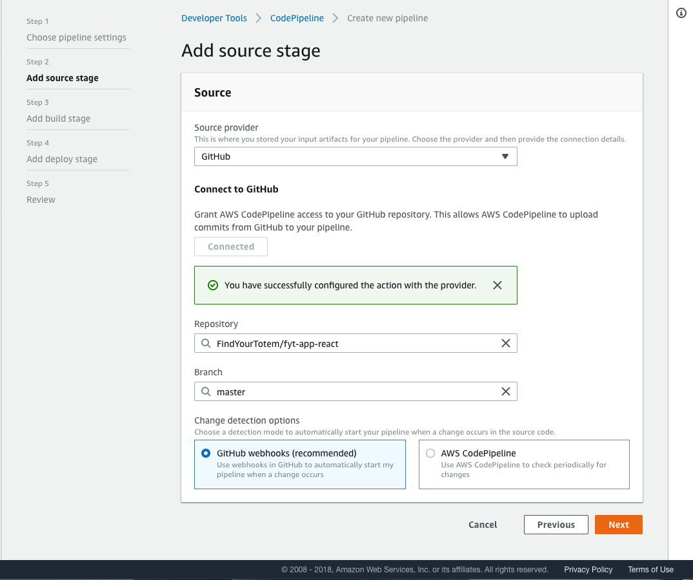
  *This will setup a webhook so that CodePipeline would be notified when changes are made to the master branch. You must have [Admin access](https://help.github.com/articles/adding-outside-collaborators-to-repositories-in-your-organization/) to the GitHub repository in order to use GitHub webhooks.*
* Build provider:
  * AWS CodeBuild
  * Project name: FYT-Website-App
  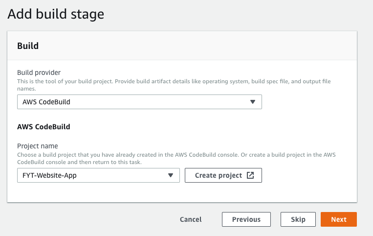
* Deploy
  * Skip
  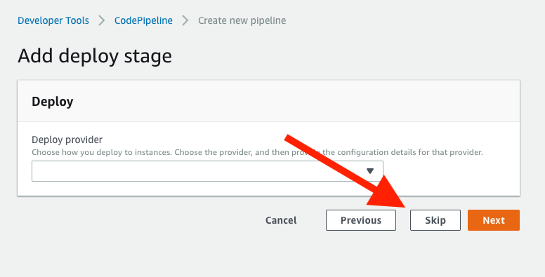
  *We don't really have a "deploy" stage for our project (since we technically "deployed" our project by moving the files onto S3). This stage is normally used for projects where you also have to run/execute the code you build (ex: for project where you're creating a docker image, you would first build/upload the docker image through CodeBuild, and then you'd run and execute the image through CodeDeploy).*
* Review settings and select "Create Pipeline"

This should create your pipeline, and any changes merged to the master branch will execute the CodePipeline, which would execute the CodeBuild project that will upload the project to S3.
